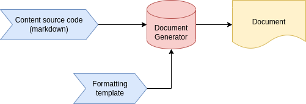

# Introduction

## A Bit About Us
- We work in the Software Engineering group at L3Harris Wescam
- Design gimbal-stabilized platforms that carry an array of sensors (cameras, lasers, etc) for air, land, and marine applications
- Most of our software targets multi-device embedded systems

## The Problem
- Our systems are complex, dynamic, and many of the design details/decisions exist only in tribal knowledge
- Our group has a grass-roots effort to preserve this knowledge in a variety of ways (formal software requirement documents, informal confluence pages, git commit messages, etc)
- Must maximize time spent creating content and minimize effort to format and maintain
- Eliminating frictions encourages our team to keep documentation up-to-date

# Part I

## What is Markdown?
- A simple mark-up language for creating formatted text in a plain-text editor
- Syntax designed to be more human-readable compared to other mark-up languages (xml, html, etc)

## Document Generation
- The document generator takes in the raw content along with any formatting parameters to produce the final document

## Dependencies

| Tool            | Description                                   | Requirement        |
|-----------------+-----------------------------------------------+--------------------|
| Pandoc          | Conversion between markup and various formats | Required           |
| Text Editor     | Sublime Text, vscode, notepad++, emacs, vim   | Required           |
| MikTex/TeX Live | Latex used as intermediate format for pdfs    | For PDFs           |
| Hugo            | Static site generator                         | For static website |
